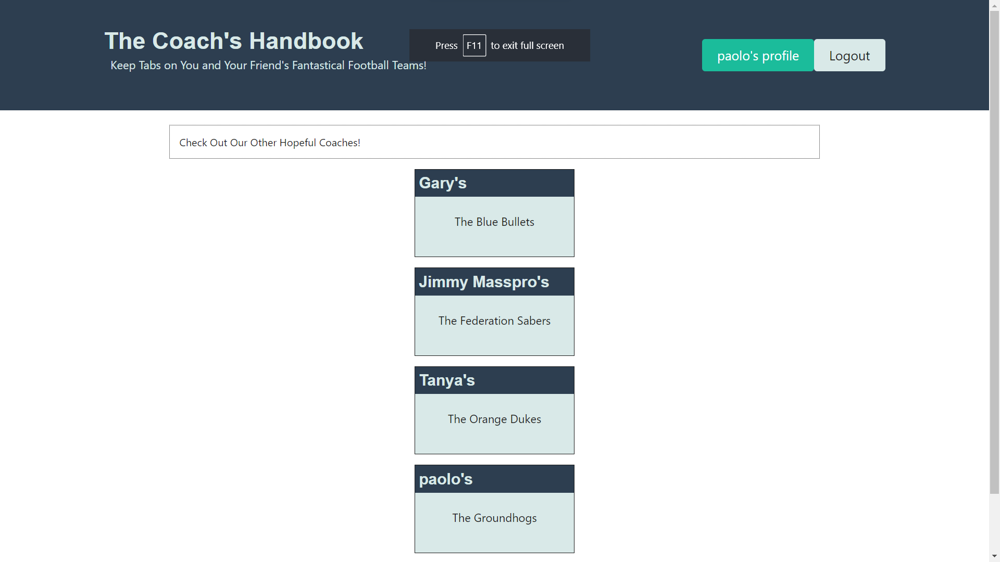
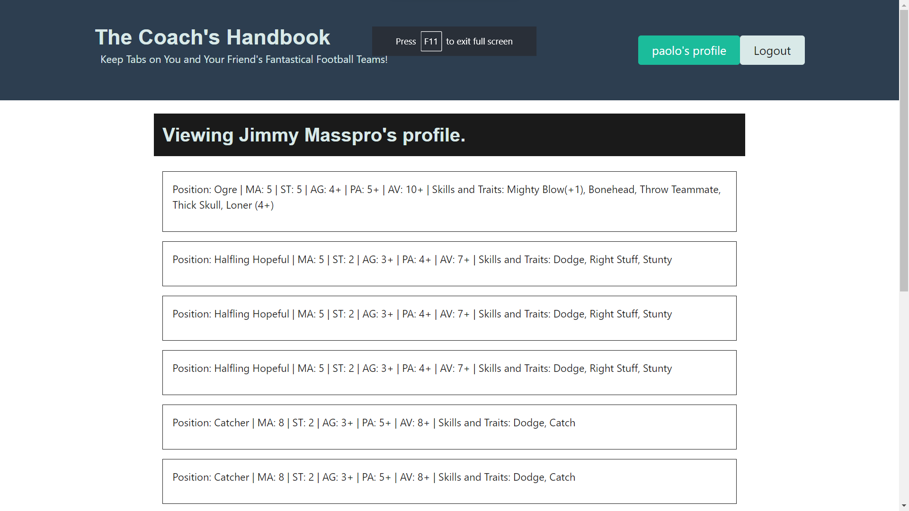

# Coachs-Handbook

A team manager for Fantasy Football boardgames

## Description

This Applicatio is designed to be used in tandem with fantasy football minitures and rules. Here users can store their team's stats and abilities and see other like-minde player's teams.

## Table of Contents

- [Installation](#installation)
- [Usage](#usage)
- [Technologies](#technologies)
- [Tests](#tests)
- [Contact](#contact)

## Installation

This site can be run (as of 10/31/2023) at the https://coach-handbook-16ef5b95c84c.herokuapp.com/.

Alternatively, it can be run locally with the command 'npm run dev' after cloning the repository and installing relevant dependenciesm though you will not be able to access foreign data this way.

## Usage

- User is presented with the home page when the application is opened. The homepage contains a list of other coachs abnd their teams. login/Sign-up button can be found in the nav bar
  -These lists of other players are links where you can
- Once a user has signed up, including registering their team name, they can access their profile and start adding players to their roster.

## Screenshots

- Home Page
  

- Profile Page
  

## Technologies

This project was made with the help of:

- MongoDB
- Mongooose
- Jsonwebtoken
- Graphql
- Apollo
- Express
- Bcrypt
- Nodemon
- React
- Happy Dom
- Jwt Decode
- Vite

## Tests

Dummy data is available in the seeds file and can be run in the terminal with the command 'npm run seed', which can be used to test functionality.

## Contact

Feel free to contact me at https://github.com/anUF0
